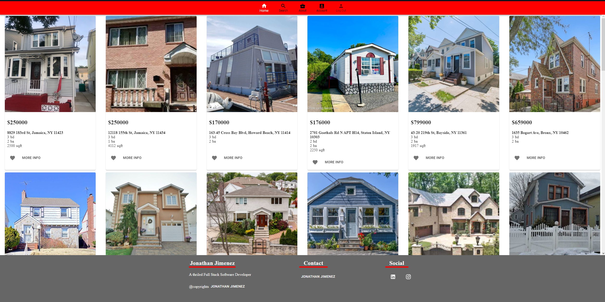
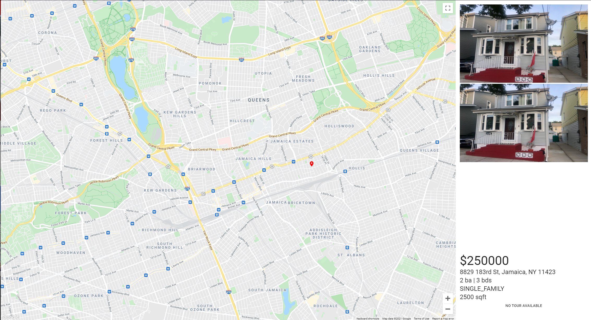
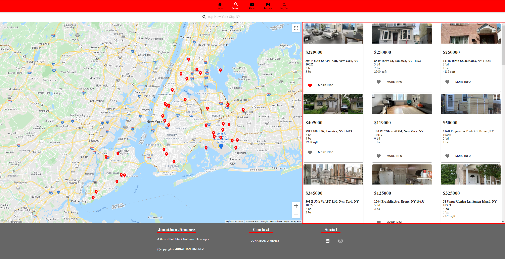

# DJANGO REAL ESTATE APP

-   This application allows users to search properties by `city, state` using Zillow Real Estate Data
-   Tech Stack of this project
-     
       
     

    [Want to search your next home?](https://real-estate-app-django.herokuapp.com/search)
    

## Showcase

## Summary

The sole purpose of this Web App, was to learn Django Framework with React for the client side and Material UI for layout etc.. I got the chance to explore how M.V.C (Model View Controller) works and recognize it's pattern. Therefore, organizing and separating data into it's own files, optimizing solutions to bugs/errors. In addition, one concept that i had difficulty understanding at first was "Serializers", which in short just serialize Python data into JSON Data. I really enjoyed and had fun how Django handles requests/responses from/to client/server which made easier separating React and API routes as well as enabling CORS (Cross Origin Resource Sharing) to a specific URL. Although at first it took me quite some time to grasp the power Django Framework has to offer and still there are some concepts that i still want to explore and learn. Below you will see the technologies used for this application.

# Author

**Jonathan Jimenez** - Full Stack Developer - [LinkedIn](https://www.linkedin.com/in/jonathan-jimenez101/) | [Website](https://www.jonathanjimenez.tech)
